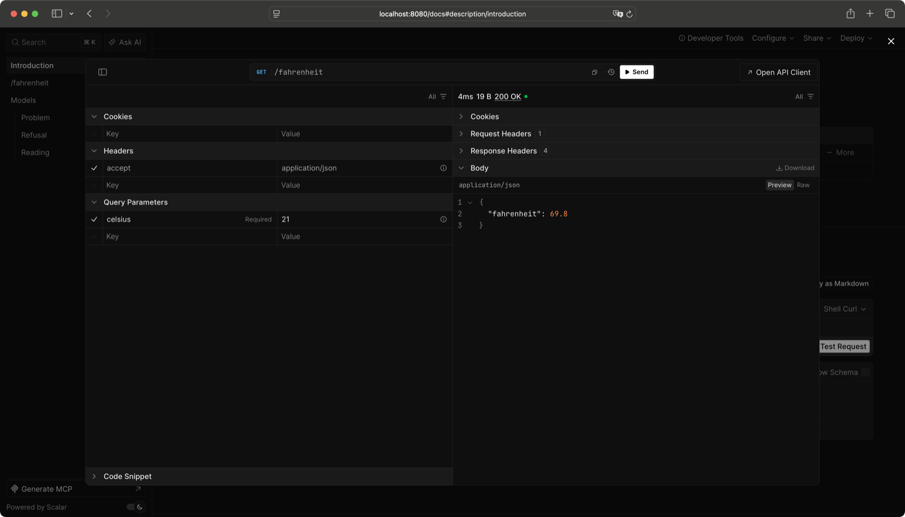

# OpenAPI

Spindle reads your API's OpenAPI 3.2 document from the routes themselves:
what each route reads, what it answers and every error it may refuse with
are already values on it. You write nothing beside the routes, so the
document never drifts from them.

## Interactive docs with Scalar

`Spindle.Openapi.docs` serves an OpenAPI document of the routes you give
it at `/openapi.json`, and Scalar's interactive reference over it at `/docs`:

```ocaml
--8<-- "openapi.ml:docs"
```

Open `http://localhost:8080/docs` for an interactive OpenAPI reference
([Scalar](https://scalar.com)) generated from your routes: every route, its
body and answer as schemas, and every code it may refuse with. You can send a
request from the browser with **Test Request**.



*A bill splitter's `POST /split`: the body's bounds come from `[@min]` and
`[@max]` on its type, and every status the route may answer is listed with
what it means.*

??? example "The app in the screenshot"

    ```ocaml
    --8<-- "split.ml:app"
    ```

- The page's script is compiled into the library and served by your server,
  so it works offline.
- Only the routes you pass are described: `api @ site @ Spindle.Openapi.docs
  api` keeps a static site out of the document.
- `~at` and `~document` move the page and the document.
- A mistake in the descriptions -- two different types under one name --
  raises before the server listens. For routes built at run time,
  `Spindle.Openapi.routes` answers a `result` instead.

??? example "The whole app"

    ```ocaml
    --8<-- "openapi.ml"
    ```

## Summaries, tags and examples

What OCaml cannot read from the types, you write on the route:

- `~summary`, `~doc` and `~tags` on every route builder (`Spindle.get`,
  `Spindle.post`, ...), and `~meta` for keys of your own
  (`Spindle.Meta.key`).
- `~examples` on an answer (`Returns.json ~examples`) or a body
  (`Spindle.json ~examples`), checked against the type.
- `Dep.credential ~scheme` marks a cookie or header as proof of who is
  asking, so the document names the scheme and which routes need it:

```ocaml
let session =
  Spindle.Dep.credential ~scheme:"session"
    (Spindle.Cookie.optional (Spindle.Cookie.named "session" Spindle.Codec.string))
```

An app lists its routes without running any of them, with `App.routes` and
`Route.pp_info`:

```ocaml
List.iter (Format.printf "%a@." Spindle.Route.pp_info) (Spindle.App.routes app)
```

```
POST /orders/{order_id}/items  -- Add an item
  path: order_id: integer
  reads: cookie session?: string, query page?: integer, body item
  credentials: session
  returns: 201 item
  refuses: 401 signed_out, 410 gone
  tags: orders
```

## The OpenAPI document

To write the document to a file, use your app's
[command line](client-schemas.md#setting-up-the-command-line): `api openapi -o FILE`.
From your own code -- a test, a script -- it is two functions:

```ocaml
Spindle.Openapi.document ~title:"Orders" app (* OpenAPI 3.2, as JSON *)
Spindle.Openapi.report app                   (* what is described loosely *)
```

`document` answers a `result`; its `Error` names two different types
described under one name. What to know when you read the document:

- **Each type with a name is a component.** Names are unique within an app.
  If a type's request and answer forms differ, the request's is
  `<Name>Input`.
- **A member that may be left out says `~absent`**, even in a type only ever
  encoded; otherwise the document calls it required.
- **Codes are responses**, grouped by status, each with what it means; the
  framework's own (`400 invalid`, `503 busy`, ...) are added from what the
  route reads.
- **Enums and bounds** are in the schema exactly as the decoder checks them.
- **The report lists what is loose**: a route that may read more than it
  declares (a `Dep.bind`, or `Dep.of_request` without `~needs`) and any
  `Wiretype.Value.json`. An empty report means the document says everything.
- A route over the rest of the path, such as `Static.directory`, is left out.

Next: [client schemas](client-schemas.md), your front end's types from the
same routes.
